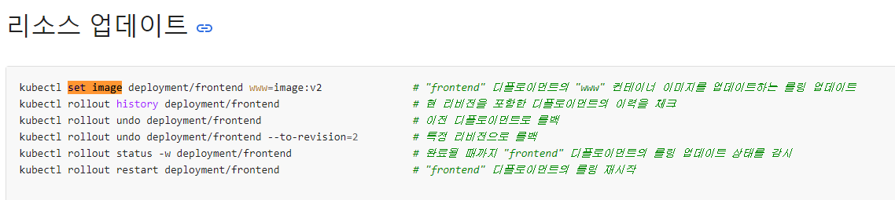
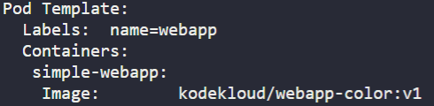
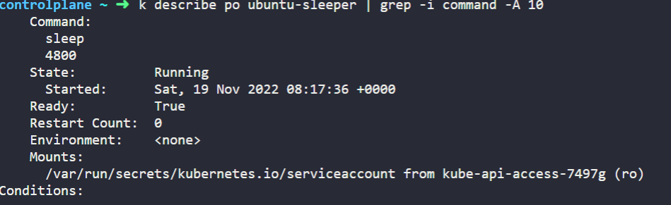
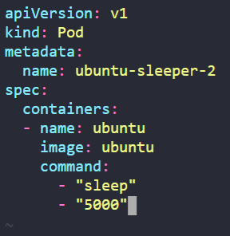
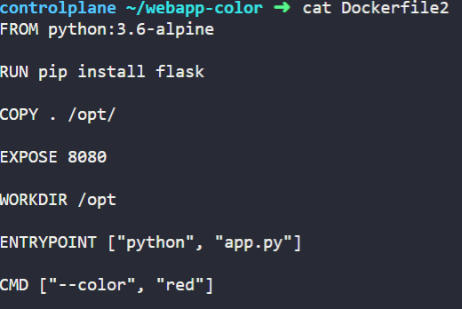
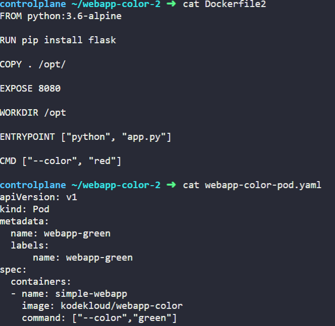
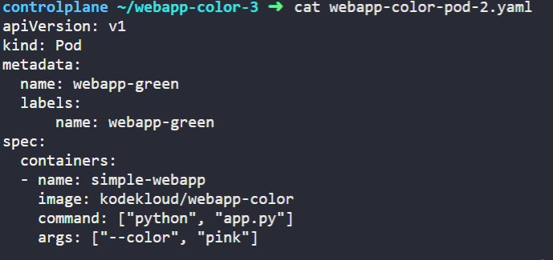

# Kubernetes Application Lifecycle Management
## 1. Rolling Updates and Rollbacks
1. 현재 frontend라는 deployment가 kodekloud/webapp-color:v1의 Image를 가지고 Rolling Update로 동작하고 있다. 해당 deployment의 Image를 kodekloud/webapp-color:v2로 upgrade하는 방법
<br></br>
kubernetes.io/docs에 cheat sheet 키워드로 검색한다.
https://kubernetes.io/ko/docs/reference/kubectl/cheatsheet/
<br></br>
리소스 업데이트 부분을 살펴보면,

<br></br>
kubectl set image deployment {deployment_name} {container_name}={new_image}:{new_version} 커맨드를 사용해 업데이트 한다. 중간의 /는 없어도 무방하다.
<br></br>
업데이트 하기 전에 기존 deploy를 describe해서 containter_name을 얻어야 한다.
<br></br>

<br></br>
simple-webapp 이라는 container_name을 가진다.
최종적으로 다음 명령을 통해 Update한다.
```
$ kubectl set image deploy frontend simple-webapp=kodekloud/webapp-color:v2
```

## 2. Commands and Arguments
1. 현재 ubuntu-sleeper라는 Pod에서 실행중인 Command를 확인하고 싶다. describe 명령에 grep -A 10을 붙여 Command 앞으로 10줄 정도를 더 확인해보자.
```
$ kubectl describe po ubuntu-sleeper | grep -i command -A 10
```

<br></br>
sleep 4800 이라는 커맨드를 실행하고 있음을 확인할 수 있다.

2. Sleep 5000을 포함하는 Pod의 구성 파일을 작성하는 방법
containers 내부에 command 항목을 집어넣고, 그 밑에 -로 커맨드의 공백을 구분한다.
<br></br>

<br></br>

3. Dockerfile이 다음과 같이 구성되어 있을 때, 컨테이너 시작 시 실행되는 커맨드
<br></br>

<br></br>
ENTRYPOINT에 있는 python app.py에 CMD에 있는 --color red가 더해져서 python app.py --color red 명령이 처음에 실행된다.

4. Dockerfile에 CMD가 존재하는데, Pod에서 command의 존재 의의?
<br></br>

<br></br>
다음과 같은 경우 Dockerfile의 ENTRYPOINT와 CMD가 Pod Definition 파일의 command로 overwrite된다. 따라서 webapp-green Po는 Dockerfile로 Dockerfile2를 사용했지만, 실행되는 command는 ["--color","green"] 뿐이다.

5. Pod Definition 파일에서 args가 있는 경우?
<br></br>

<br></br>
webapp-green Pod에서 가장 처음으로 실행되는 command는
<br></br>
python app.py --color pink이다.


