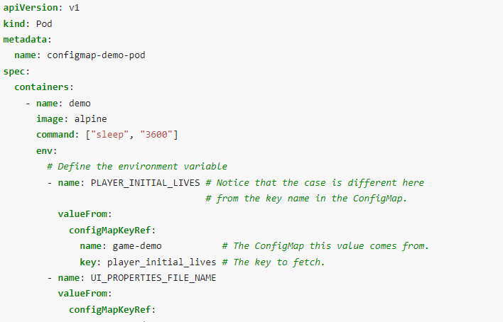
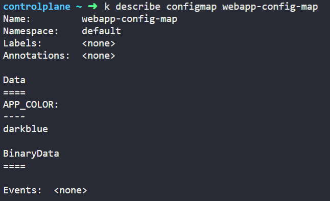
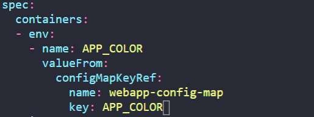
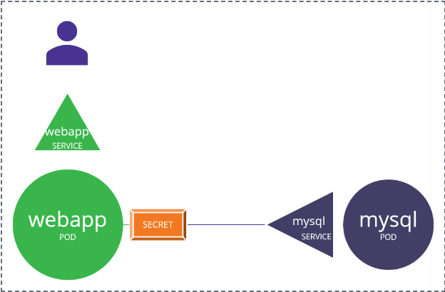
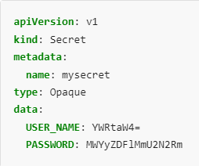
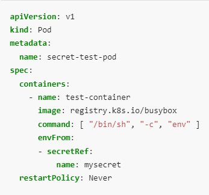
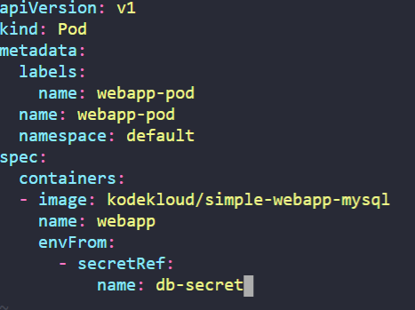

# Kubernetes Application Lifecycle Management
## 1. Rolling Updates and Rollbacks
1. 현재 frontend라는 deployment가 kodekloud/webapp-color:v1의 Image를 가지고 Rolling Update로 동작하고 있다. 해당 deployment의 Image를 kodekloud/webapp-color:v2로 upgrade하는 방법
<br></br>
kubernetes.io/docs에 cheat sheet 키워드로 검색한다.
https://kubernetes.io/ko/docs/reference/kubectl/cheatsheet/
<br></br>
리소스 업데이트 부분을 살펴보면,

<br></br>
kubectl set image deployment {deployment_name} {container_name}={new_image}:{new_version} 커맨드를 사용해 업데이트 한다. 중간의 /는 없어도 무방하다.
<br></br>
업데이트 하기 전에 기존 deploy를 describe해서 containter_name을 얻어야 한다.
<br></br>

<br></br>
simple-webapp 이라는 container_name을 가진다.
최종적으로 다음 명령을 통해 Update한다.
```
$ kubectl set image deploy frontend simple-webapp=kodekloud/webapp-color:v2
```

## 2. Commands and Arguments
1. 현재 ubuntu-sleeper라는 Pod에서 실행중인 Command를 확인하고 싶다. describe 명령에 grep -A 10을 붙여 Command 앞으로 10줄 정도를 더 확인해보자.
```
$ kubectl describe po ubuntu-sleeper | grep -i command -A 10
```

<br></br>
sleep 4800 이라는 커맨드를 실행하고 있음을 확인할 수 있다.

2. Sleep 5000을 포함하는 Pod의 구성 파일을 작성하는 방법
containers 내부에 command 항목을 집어넣고, 그 밑에 -로 커맨드의 공백을 구분한다.
<br></br>

<br></br>

3. Dockerfile이 다음과 같이 구성되어 있을 때, 컨테이너 시작 시 실행되는 커맨드
<br></br>

<br></br>
ENTRYPOINT에 있는 python app.py에 CMD에 있는 --color red가 더해져서 python app.py --color red 명령이 처음에 실행된다.

4. Dockerfile에 CMD가 존재하는데, Pod에서 command의 존재 의의?
<br></br>

<br></br>
다음과 같은 경우 Dockerfile의 ENTRYPOINT와 CMD가 Pod Definition 파일의 command로 overwrite된다. 따라서 webapp-green Po는 Dockerfile로 Dockerfile2를 사용했지만, 실행되는 command는 ["--color","green"] 뿐이다.

5. Pod Definition 파일에서 args가 있는 경우?
<br></br>

<br></br>
webapp-green Pod에서 가장 처음으로 실행되는 command는
<br></br>
python app.py --color pink이다.

## 3. Env Variables
1. Pod의 ENV를 configmap에 있는 key: value 값으로 바꾸는 방법
<br></br>
kubernetes.io/docs에 configmap 키워드로 검색한다.
https://kubernetes.io/docs/concepts/configuration/configmap/
<br></br>
Pod의 Env에 Configmap이 어떻게 매핑되어 있는지를 확인할 수 있다.
<br></br>

<br></br>
valueFrom 밑에 configMapKeyRef를 통해 ConfigMap의 이름을 입력하고, 그 ConfigMap에 있는 key 값을 넣어주면 Pod에 Configmap의 key: value를 매핑할 수 있다.
다음 Configmap을 보자.

APP_COLOR에 darkblue가 key: value쌍으로 존재하고 있다.
이를 Pod에 넣어서 활용해 보자.
<br></br>

<br></br>
Pod내에서 APP_COLOR라는 환경변수를 webapp-config-map의 Key 값인 APP_COLOR에 해당하는 Value값에 매칭시킬 수 있다. 이 경우는 Value값이 darkblue가 된다.

## 4. Secrets
1.  다음 아키텍처에서
<br></br>

<br></br>
Secret Name: db-secret, Secret 1: DB_Host=sql01, Secret 2: DB_User=root, Secret 3: DB_Password=password123
에 해당하는 Secret을 생성하는 방법
(1) yaml파일을 이용한 방식
kubernetes.io/docs에 secret 키워드로 검색해 use cases에서 컨테이너 환경 변수로 사용하는 사례를 살펴본다.
https://kubernetes.io/docs/concepts/configuration/secret/
<br></br>

<br></br>
data 부분에 해당하는 타입의 key: value 값을 넣어주면 된다.

(2) 커맨드를 이용한 방식
<br></br>
kubectl create secret generic {secret_name} --from-literal={key}={value} 커맨드를 이용한다
```
$ kubectl create secret generic db-secret --from-literal=DB_Host=sql01 --from-literal=DB_User=root --from-literal=DB_Password=password123
```
create secret 뒤에 generic이 붙어야 하는 것을 주의한다.

2. 기존에 동작중인 webapp-pod가 새로 생성된 db-secret secret으로부터 env를 load할 수 있도록 구성한다.
<br></br>
kubernetes.io/docs에 secret 키워드로 검색해 Secret을 컨테이너의 env로 사용하는 내용 중 envFrom을 살펴본다.
<br></br>
https://kubernetes.io/docs/concepts/configuration/secret/
<br></br>

<br></br>
컨테이너 내에서 envFrom의 secretRef를 통해 참조하고 싶은 secret의 이름을 기입한다.
기존에 동작중인 Pod에서 작업을 진행해야 하므로, kubectl edit pod를 통해 본 작업과 관련없는 내용을 모두 지우고 필요한 envFrom만을 넣어서 진행한다.
<br></br>

<br></br>


