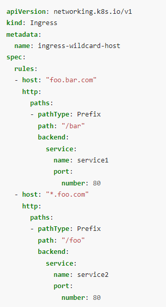
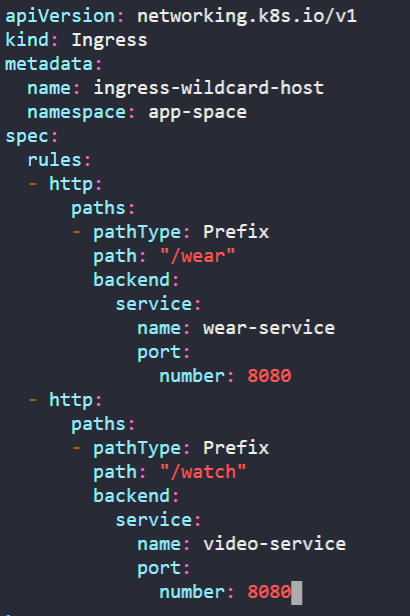
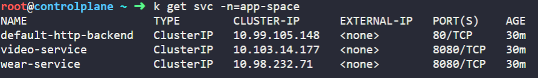

# Kubernetes Networking
## 1. Ingress
1. app-space라는 namespace에서 /wear /watch에 Ingress Service를 구성하는 Ingress Resource를 생성하는 방법
  
Path: /wear
  
Path: /watch
  
Configure correct backend service for /wear
  
Configure correct backend service for /watch
  
Configure correct backend port for /wear service
  
Configure correct backend port for /watch service
  
kubernetes.io/docs에 ingress 키워드로 검색한다.
service를 백엔드로 구성하는 ingress 구성 방법을 확인한다.
https://kubernetes.io/docs/concepts/services-networking/ingress/
  

  
필요없는 부분을 삭제하면서 하위 항목들을 나열하기 위한 -를 삭제하지 않도록 주의한다. 삭제했다면 추가해준다.
- host 줄을 삭제했다면, http 줄에 -를 붙여준다.
  

  
각각의 service들이 8080 포트를 노출하고 있기 때문에, ingress를 구성하는 과정에서도 port number를 해당 숫자로 넣어준다.
  

  

