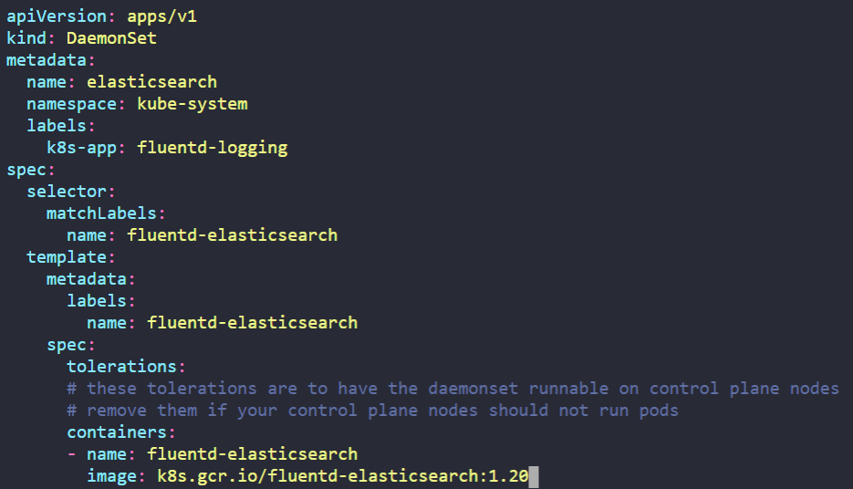

# kubernetes Scheduling
## 1. Manual Scheduling
1. node01에 Pod를 Manually Schedule 하는법


<!-- Pod를 할당하려는 Node에 특정 label을 labeling한다. -->
kubernetes.io/docs에 manual schedule 키워드로 검색한다.
https://kubernetes.io/docs/concepts/scheduling-eviction/assign-pod-node/
<br></br>
nodeName에 대한 설명을 보면, 다음과 같이 특정 노드에 스케줄링 할 수 있다.
<br></br>

<br></br>
## 2. Labels And Selectors
1. Pod들이 tier, env, bu로 Labeling 되어 있을 때, env Label이 dev값을 가지는 Pod의 개수를 구하는 법

(1) env label을 가지는 모든 Pod를 검색하여 값이 dev인 것을 센다.
```
$ kubectl get po -L=env
```

(2) --selector옵션을 이용해 원하는 Label:value 값만을 추출한다.
```
$ kubectl get po --selector env=dev
```


2. 중복으로 Labeling된 Pod를 검색하는 방법
--selector 뒤에 Label:value들을 콤마(,)로 구분한다
```
$ kubectl get po --selector env=prod,bu=finance,tier=frontend
```

## 3. Taints And Tolerations
1. node01에 key는 spray를 가지고 value는 mortein을 가지면서 NoSchedule Effect를 갖도록 하는 Taint를 생성하는 방법
```
$ kubectl taint nodes node01 spray=mortein:NoSchedule
```
2. Pod name: bee, Image name: nginx, Key: spray, Value: mortein, Effect: NoSchedule이며, Value 값으로 mortein을 가지는 Taint를 용인할 수 있는 Pod를 생성하는 방법
kubernetes.io/docs에 Taints 키워드로 검색한다.
https://kubernetes.io/ko/docs/concepts/scheduling-eviction/taint-and-toleration/
<br></br>
생성하려는 Pod에 Toleration을 적용하면, Node의 Taint를 용인할 수 있다.


<br></br>
다음과 같이 tolerations을 구성하는 방식에는 key와 value가 "Equal"일 때만 용인하는 방식, key가 "Exists"하기만 하면 용인하는 방식이 있다.
문제에서 key와 value가 모두 주어졌으므로 Equal인 경우를 사용한다.


node01에 Taint가 있음에도 bee Pod가 할당된 모습이다.


3. controlplane 노드에 Taint가 있는지 확인하는 방법
```
$ kubectl get nodes controlplane | grep -i taint
Taints:             node-role.kubernetes.io/control-plane:NoSchedule
```

4. controlplane 노드의 Taint를 제거하는 방법
kubectl taint 명령을 통해 노드에 걸려있는 taint에 대한 내용 중 effect 앞 내용까지 복사한 후 -를 붙여주면 Taint를 해제할 수 있다.
```
$ kubectl taint nodes controlplane node-role.kubernetes.io/control-plane-
```

## 4. Node Affinity
1. node01 에 color=blue라는 label을 적용
kubectl label node {node_name} {key}={value}
```
$ kubectl label node node01 color=blue
```

2. Name: blue, Replicas: 3, Image: nginx인 deployment가 있을 때, requiredDuringSchedulingIgnoredDuringExecution인 NodeAffinity를 갖게 하고 key: value 값으로 color: blue를 가지도록 수정하는 방법
kubernetes.io/docs에 NodeAffinity 키워드로 검색한다.
https://kubernetes.io/docs/tasks/configure-pod-container/assign-pods-nodes-using-node-affinity/
<br></br>


Pod의 spec 아래에 affinity 관련 내용을 넣고, matchExpressions 부분에서 key와 value를 color와 blue로 바꾸어준다.
현재 실행중인 blue deployment를 edit 하여 필요 없는 부분은 삭제하고 해당 내용을 넣는다.
```
$ kubectl edit deploy blue
```
vi 편집기에서 esc를 누른 후 dd를 누르면 해당 줄이 삭제되며, .을 통해 이전 커맨드를 반복할 수 있다. 혹시 잘못 삭제했다면 u를 눌러 되돌릴 수 있다.


change가 저장된 파일을 kubectl apply 해주면 해당 리소스가 overwrite 되어 정상으로 동작한다.

3. Name: red
Replicas: 2
Image: nginx
NodeAffinity: requiredDuringSchedulingIgnoredDuringExecution
Key: node-role.kubernetes.io/control-plane
의 내용을 가지는 deploy를 생성하는 방법.
<br></br>
(1) 일단 기본 deploy의 format을 가지는 파일을 생성한다.
```
$ kubectl create deploy red --image=nginx --replicas=2 --dry-run=client -o yaml > red.yaml
```
(2) NodeAffinity를 적용한다. 앞서 말했듯이 operator에는 크게 Equal과 In, Exists가 있는데 Exists를 사용한다.


## 5. Resource Limits
1. rabbit이라는 name의 Pod가 deploy 되어 있다. 해당 Pod에 설정된 CPU Requirements를 구하는 방법
```
$ kubectl describe pod rabbit
```

<br></br>
Limits은 Pod가 사용하는 자원량을 제한한다. 해당 Pod는 cpu를 2개보다 많이 사용할 수 없다.
Requests는 실제로 요청하는 자원의 양이므로, 문제에서 원하는 바와 부합한다.

2. 현재 동작중인 elephant Pod가 OOMKilled 상태인데, 이는 Pod가 Limit양을 초과하는 리소스를 소비했기 때문이다. elephant Pod의 Limit을 20Mi로 늘려야 한다.
kubectl edit을 통해 해당 Section의 Value를 수정해준다.

```
$ kubectl edit pod elephant
```

<br></br>
혹시 overwrite가 되지 않는다면 동작중인 Pod를 삭제하고 다시 만든다.

## 6. DaemonSets
1. Cluster에서 모든 namespace의 Daemonsets개수?
```
$ kubectl get daemonsets -A
```
2.Name: elasticsearch
Namespace: kube-system
Image: k8s.gcr.io/fluentd-elasticsearch:1.20 를 가지는
FluentD Logging을 위한 Daemonsets를 배포해라.

kubernetes.io/docs에 Daemonset 키워드로 검색한다.
https://kubernetes.io/docs/concepts/workloads/controllers/daemonset/
<br></br>

<br></br>
해당 내용을 복사하고, 문제에서 명시되지 않은 부분은 모두 과감히 삭제한다.


daemonset이 배포됐음을 확인할 수 있다.
