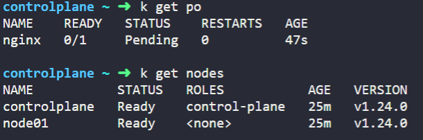
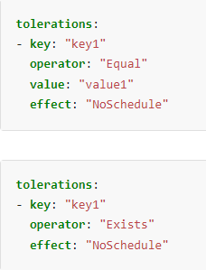
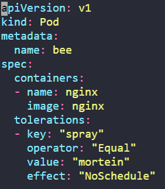

# kubernetes Scheduling
## 1. Manual Scheduling
1. node01에 Pod를 Manually Schedule 하는법


<!-- Pod를 할당하려는 Node에 특정 label을 labeling한다. -->
kubernetes.io/docs에 manual schedule 키워드로 검색한다.
https://kubernetes.io/docs/concepts/scheduling-eviction/assign-pod-node/
<br></br>
nodeName에 대한 설명을 보면, 다음과 같이 특정 노드에 스케줄링 할 수 있다.
<br></br>

<br></br>
## 2. Labels And Selectors
1. Pod들이 tier, env, bu로 Labeling 되어 있을 때, env Label이 dev값을 가지는 Pod의 개수를 구하는 법

(1) env label을 가지는 모든 Pod를 검색하여 값이 dev인 것을 센다.
```
$ kubectl get po -L=env
```

(2) --selector옵션을 이용해 원하는 Label:value 값만을 추출한다.
```
$ kubectl get po --selector env=dev
```


2. 중복으로 Labeling된 Pod를 검색하는 방법
--selector 뒤에 Label:value들을 콤마(,)로 구분한다
```
$ kubectl get po --selector env=prod,bu=finance,tier=frontend
```

## 3. Taints And Tolerations
1. node01에 key는 spray를 가지고 value는 mortein을 가지면서 NoSchedule Effect를 갖도록 하는 Taint를 생성하는 방법
```
$ kubectl taint nodes node01 spray=mortein:NoSchedule
```
2. Pod name: bee, Image name: nginx, Key: spray, Value: mortein, Effect: NoSchedule이며, Value 값으로 mortein을 가지는 Taint를 용인할 수 있는 Pod를 생성하는 방법
kubernetes.io/docs에 Taints 키워드로 검색한다.
https://kubernetes.io/ko/docs/concepts/scheduling-eviction/taint-and-toleration/
<br></br>
생성하려는 Pod에 Toleration을 적용하면, Node의 Taint를 용인할 수 있다.


<br></br>
다음과 같이 tolerations을 구성하는 방식에는 key와 value가 "Equal"일 때만 용인하는 방식, key가 "Exists"하기만 하면 용인하는 방식이 있다.
문제에서 key와 value가 모두 주어졌으므로 Equal인 경우를 사용한다.




node01에 Taint가 있음에도 bee Pod가 할당된 모습이다.


3. controlplane 노드에 Taint가 있는지 확인하는 방법
```
$ kubectl get nodes controlplane | grep -i taint
Taints:             node-role.kubernetes.io/control-plane:NoSchedule
```

4. controlplane 노드의 Taint를 제거하는 방법
kubectl taint 명령을 통해 노드에 걸려있는 taint에 대한 내용 중 effect 앞 내용까지 복사한 후 -를 붙여주면 Taint를 해제할 수 있다.
```
$ kubectl taint nodes controlplane node-role.kubernetes.io/control-plane-
```

## 4. Node Affinity
