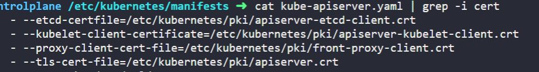
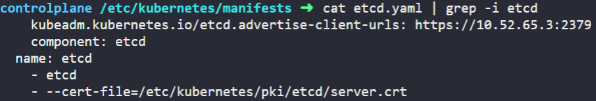
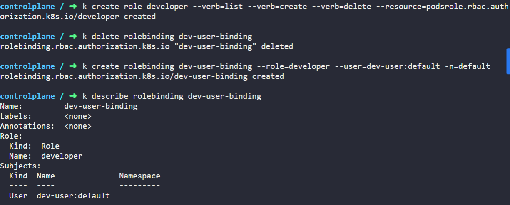
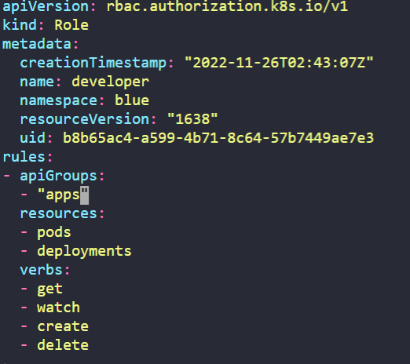

# Kubernetes Security
## 1. View Certificate details
1. kube-api server Pod의 certificate 파일을 확인하는 방법
```
$ cat /etc/kubernetes/manifests/kube-apiserver.yaml 
```
--tls-cert-file에 있는 경로를 확인한다.
<br></br>

<br></br>
/etc/kubernetes/pki/apiserver.crt임을 확인할 수 있다.

2. ETCD server Pod의 ETCD server를 hosting하기 위한 Certificate 파일을 확인하는 방법
```
$ cat /etc/kubernetes/manifests/etcd.yaml 
```
--cert-file의 경로를 확인한다.
<br></br>

<br></br>
/etc/kubernetes/pki/etcd/server.crt임을 확인할 수 있다.

## 2. kubeconfig
kubeconfig 파일이란
- kubernetes의 설정 파일이며 클러스터의 apiserver에 접근할 때 사용할 인증 관련 정보를 가지고 있음.
- 클러스터, 사용자, 네임스페이스 및 인증 매커니즘에 대한 정보를 관리하는 파일로 클러스터에 대한 접근을 구성하는데 사용, 구성 파일을 참조하는 일반적인 방법
1. default kubeconfig 파일의 위치
```
$ controlplane ~/.kube ➜  ls
cache  config
```
/root/.kube/디렉토리에 위치한 config 파일이다.

2. /root/my-kube-config 안에 있는 "research" context로 전환하고 확인하는 방법
전환
<br></br>
kubectl config --kubeconfig={내 kubeconfig 파일의 위치} use context {전환하고 싶은 context}
```
$ controlplane ~ ➜ kubectl config --kubeconfig=/root/my-kube-config use-context research

```
확인
<br></br>
kubectl config --kubeconfig={내 kubeconfig 파일의 위치} current-context

## 3. Role Based Access Control
1. dev-user라는 user에게 list,create,delete 권한을 할당하는 role과 rolebinding을 만드는 방법
Role: developer

Role Resources: pods

Role Actions: list

Role Actions: create

Role Actions: delete

RoleBinding: dev-user-binding

RoleBinding: Bound to dev-user
<br></br>
role을 생성하기 위해서는
kubectl create role {role_name} --verb={actions} --verb={actions} --verb={actions} --resource={Resources} -n={namespace} 작업을 거친다.
<br></br>
user를 위한 rolebinding을 생성하기 위해서는
<br></br>
kubectl create {rolebinding_name} --role={role name to Bound} --user={user name to Bound} -n={namespace_name} 작업을 거친다.
<br></br>
ServiceAccount를 위한 rolebinding을 생성하기 위해서는
<br></br>
kubectl create {rolebinding_name} --role={role name to Bound} --serviceaccount={serviceaccount's namespace}:{serviceaccount name to Bound} -n={namespace_name} 작업을 거친다    

<br></br>

<br></br>

2. 현재 동작중인 developer role을 기반으로 dev-user에게 blue namespace에서 deployment를 만들 수 있는 권한을 할당하는 rule을 만드는 방법
(1) role을 수정한다.
role은 클러스터 전체의 namespace에서 영향력을 발휘하는 ClusterRole과는 달리 각 namespace별로 동작하기 때문에 namespace 명시를 해주어야 한다.
<br></br>

<br></br>
resource에 deployment를 추가한다. 또한 deployment를 api group이 apps인 곳에서 동작하기 때문에 apiGroups에 내용을 추가한다.

## 4. Cluster Roles
1. 다음과 같은 스펙의 Resource를 생성

 ClusterRole: storage-admin

Resource: persistentvolumes

Resource: storageclasses

ClusterRoleBinding: michelle-storage-admin

ClusterRoleBinding Subject: michelle

ClusterRoleBinding Role: storage-admin

clusterRole은 namespace에 상관없이 영향력을 발휘한다는 점을 인지한다.
Role 그리고 RoleBinding을 만드는 방법과 크게 다르지 않다.
ClusterRole의 경우는
<br></br>
kubectl create clusterrole <clusterrole_name> --resource={resource to permit} --verb={action to permit}
--resource와 --verb는 ,를 붙이지 않고 여러 개 쓸 수 있다.
ClusterRoleBinding의 경우는
<br></br>
kubectl create clusterrolebinding <clusterrolebinding_name> --clusterrole={clusterRole to Bound} --user={user to permit}
의 형태로 작성한다. subject의 경우 user도 될 수 있고 serviceaccount도 될 수 있는데, user가 아닌 serviceaccount의 경우
--serviceaccount={'namespace name' in serviceaccount}:{serviceaccount name}의 형태로 작성한다.
```
controlplane ~ ➜ kubectl create clusterrole storage-admin --resource=persistentvolume --resource=storageclasses --verb=get --verb=list --verb=watch --verb=create --verb=delete
clusterrole.rbac.authorization.k8s.io/storage-admin created
controlplane ~ ➜ kubectl create clusterrolebinding --clusterrole=storage-admin --user=michelle
clusterrolebinding.rbac.authorization.k8s.io/michelle-storage-admin created
```
