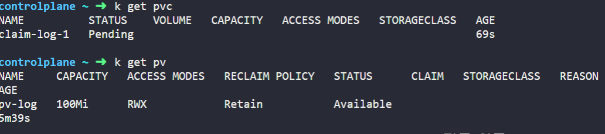
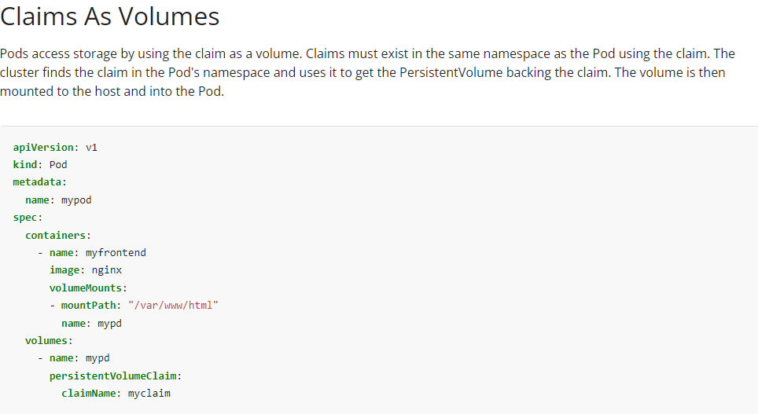
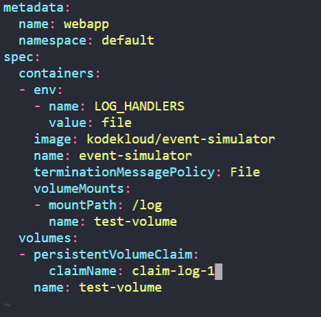

# Kubernetes Storage
## 1. PersistentVolumeClaims
1. webapp이라는 Pod가 log들을 /log/app.log에 보관하고 있다. 확인 방법
kubectl exec {pod_name} -- {command} {path}
```
$ kubectl exec webapp -- cat /log/app/log
```
2. 해당 Pod의 log들을 현재 Host의 /var/log/webapp에도 저장하도록 volume을 구성하는 방법
<br></br>
Volume HostPath: /var/log/webapp
<br></br>
Volume Mount: /log를 만족시키도록 webapp Pod를 수정한다.
Volume이 HostPath이므로 kubernetes.io/docs에 hostpath를 키워드로 입력한다. https://kubernetes.io/docs/concepts/storage/volumes/
<br></br>

<br></br>
hostPath의 configuration은 다음과 같다. volumes 밑에 hostpath를 선언하고 그 위의 spec밑에 container에서 volumeMount로 그 volume을 사용하면 된다.
<br></br>

<br></br>

3. 다음 spec을 가지는 Persistent Volume 생성한다.
<br></br>
Volume Name: pv-log
<br></br>
Storage: 100Mi
<br></br>
Access Modes: ReadWriteMany
<br></br>
Host Path: /pv/log
<br></br>
Reclaim Policy: Retain
<br></br>
kubernetes.io/docs에 Persistent Volume 키워드로 검색한다.
https://kubernetes.io/docs/concepts/storage/persistent-volumes/
<br></br>

<br></br>
이 경우는 nfs대신 hostPath를 넣어 작성한다.
<br></br>

<br></br>
4. Persistent Volume Claim를 해당 spec에 맞게 생성한다.
Volume Name: claim-log-1
<br></br>
Storage Request: 50Mi
<br></br>
Access Modes: ReadWriteOnce
<br></br>
PV docs에 같이 존재한다.
<br></br>

<br></br>
마찬가지로 해당하는 내용들을 기입한다.
<br></br>

<br></br>
5. PVC가 Bounding되지 않은 이유
<br></br>

<br></br>
PV와 PVC의 Access Mode가 일치하지 않는다.
6. webapp Pod의 volume을 hostPath에서 새로 생성한 PVC로 바꾸는 방법
<br></br>

<br></br>
해당 docs 문서에 Pod에서 PVC를 어떻게 선언하고 활용하는지에 대한 내용이 있다. hostPath와 유사하게 volume 이름을 선언하고, PersistentVolumeClaim을 설정한 다음 claimName을 기입하면 된다.
<br></br>

<br></br>
PVC를 Pod내에서 선택했고, 그 PVC를 Volume으로 선언하였고, 그 Volume을 Container 내에서 volumeMount하여 해당 Volume과 mountPath가 연동되도록 구성했다.
