# kubernetes troubleshooting
## 1. Application Failure
- check Service: Service의 Selector에 있는 labels이 현재 동작되는 Application(pod)의 labels와 같은지 확인
- 다음과 같은 아키텍처 구조에서 직접 troubleshooting 해보기
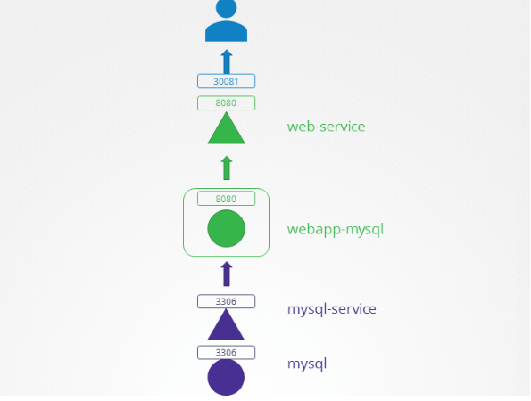
1. mysql-service
```
$ kubectl describe svc mysql-service -n=beta
Name:              mysql-service
Namespace:         beta
Labels:            <none>
Annotations:       <none>
Selector:          name=mysql
Type:              ClusterIP
IP Family Policy:  SingleStack
IP Families:       IPv4
IP:                10.43.111.162
IPs:               10.43.111.162
Port:              <unset>  3306/TCP
TargetPort:        8080/TCP
Endpoints:         10.42.0.11:8080
Session Affinity:  None
Events:            <none>
```
TargetPort가 해당 아키텍쳐와 달리 8080으로 설정되어 있으므로, 3306으로 바꾸어준다.
```
apiVersion: v1
kind: Service
metadata:
  name: mysql-service
  namespace: beta
spec:
    ports:
    - port: 3306
      targetPort: 3306
    selector:
      name: mysql
```
2. Service의 Selector와 expose해야되는 pod의 Labels가 일치하는지 확인
```
$ kubectl describe svc mysql-service -n=gamma
Name:              mysql-service
Namespace:         gamma
Labels:            <none>
Annotations:       <none>
Selector:          name=sql00001

$ kubectl describe po mysql -n=gamma
Name:         mysql
Namespace:    gamma
Priority:     0
Node:         controlplane/172.25.0.16
Start Time:   Sat, 12 Nov 2022 14:22:52 +0000
Labels:       name=mysql
```
mysql-service의 Selector를 'edit svc'를 통해 name=mysql로 바꾸어준다.
3. Service의 NodePort 확인
```
$ kubectl -n zeta get svc web-service
NAME          TYPE       CLUSTER-IP    EXTERNAL-IP   PORT(S)          AGE
web-service   NodePort   10.43.8.200   <none>        8080:30088/TCP   19s
```
NodePort는 30081번이 open되어 있어야 하지만,30088이 open되어 있으므로 'edit svc'를 통해 .spec.ports.nodePort 값을 수정한다.

## 2. Control Plane Failure
(1)잘못된 부분을 찾아본다. kubernetes는 파드 기반으로 되어 있는 시스템이기에, 파드에 문제가 있는지 살펴본다.
모든 네임스페이스의 파드를 호출해본다.
```
$ kubectl get pod -A
```
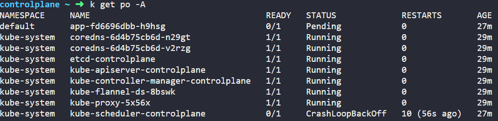
<br></br>
kube-scheduler-controlplane Pod에서 오류가 났다. describe 
해서 살펴보면,
<br></br>
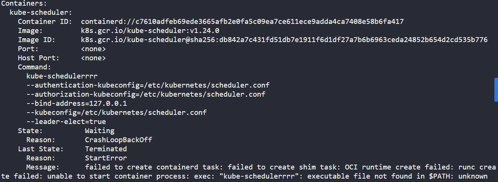
<br></br>
Command가 잘못됐음을 확인할 수 있다. 이를 수정하기 위해 /etc/kubernetes/manifests로 이동하여 kube-scheduler를 수정한다.
<br></br>
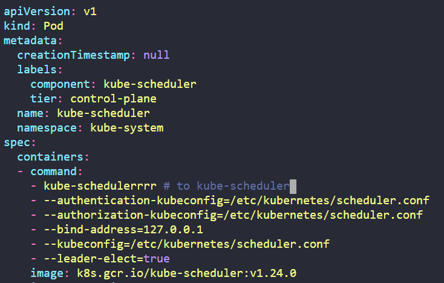
<br></br>
(2)이번에도 잘못된 부분을 찾아본다.
```
$ kubectl get pod -A
```
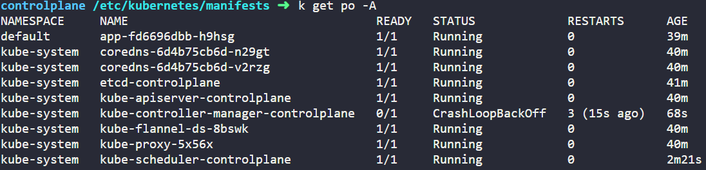
<br></br>
이번에는 controller-manager 파드가 고장이 났다.
똑같이 troubleshooting하기 위해 describe 해본다.
```
$ kubectl describe pod kube-controller-manager-controlplane -n=kube-system
```
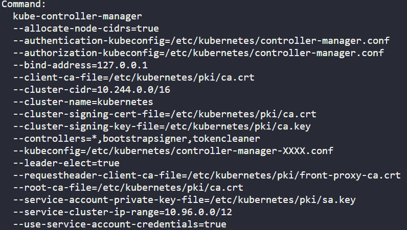
<br></br>
kubeconifg의 경로가 이상하다. controller-manager-XXXX.conf의 원형을 찾기 위해 해당 경로로 이동한다.
```
$ controlplane /etc/kubernetes ➜  ls
admin.conf  controller-manager.conf  kubelet.conf  manifests  pki  scheduler.conf
```
원형은 controller-manager.conf임을 알 수 있다.
/etc/kubernetes/manifests/kube-controller-manager.yaml의 kubeconfig 부분을 수정한다.

<br></br>
(3)이번에도 잘못된 부분을 찾아본다.
```
$ kubectl get pod -A
```
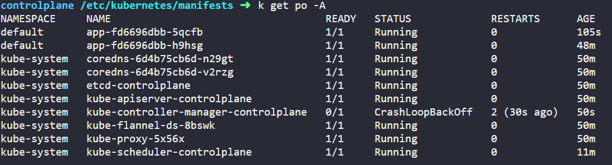
이번에는 kube-controller-manager-controlplane에 오류가 났다. 똑같이 describe 해본다.
```
$ kubectl describe po kube-controller-manager-controlplane -n=kube-system
```
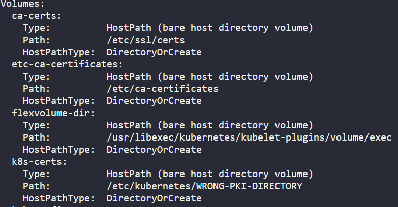
<br></br>
Volumes의 k8s-certs가 가지고 있는 HostPath 타입의 Path가 이상하다. /etc/kubernetes/manifests/kube-controller-manager.yaml 파일의 Volume 부분에서 k8s-certs의 Path를 /etc/kubernetes/pki로 바꾸어 준다.
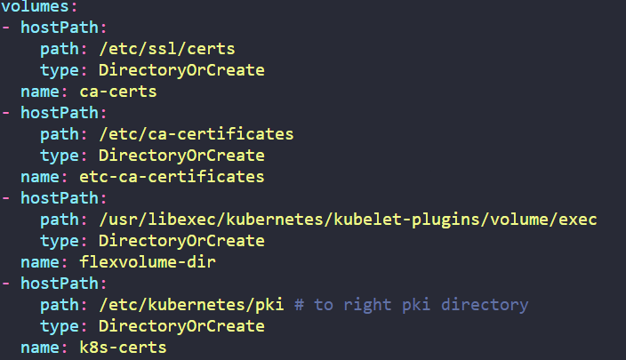
<br></br>
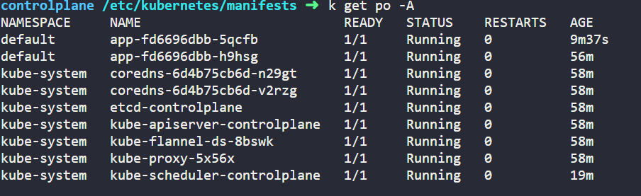
모든 Pod가 문제없이 작동하는 것을 확인할 수 있다.
<br></br>
## 3. Worker Node Failure
WorkerNode의 경우는 Broken된 해당 노드로 ssh해서 잘못된 부분을 찾는다.
가장 대표적인 Worker Node의 잘못된 이유 중 하나인 kubelet이 문제가 없는지 살펴본다.
(1)
```
$ root@node01 ~ ➜  systemctl status kubelet
```

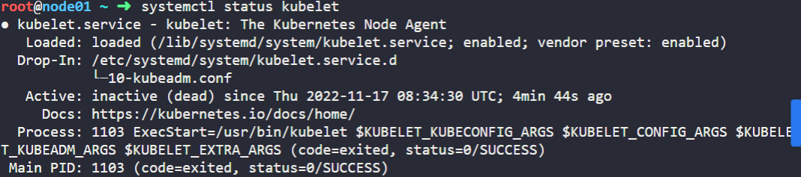
kubelet에 문제가 생긴 듯 하다. kubelet을 restart 해본다.

```
$ root@node01 ~ ➜  systemctl restart kubelet
$ root@node01 ~ ➜  systemctl status kubelet
```
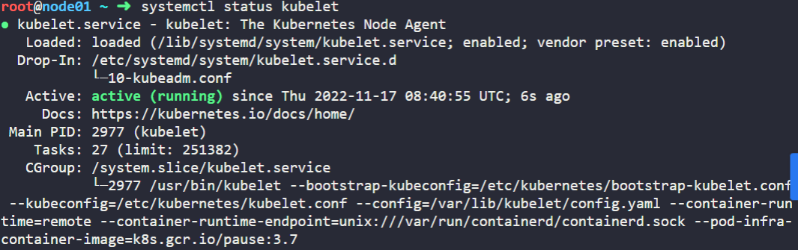
정상으로 돌아왔다.
<br></br>
(2)
```
$ root@node01 ~ ➜  systemctl status kubelet
```

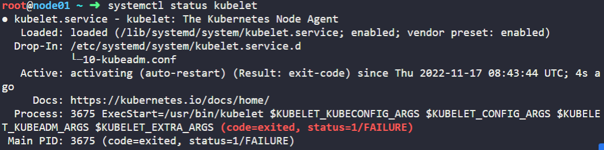
kubelet에 문제가 생긴 듯 하다.
journalctl을 통해 서비스 로그를 적당히 파악하고 stop하여 로그들을 살펴본다.
```
$ root@node01 ~ ➜  journalctl -u kubelet -f
```
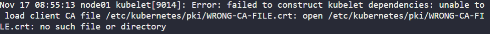
crt파일의 경로가 잘못 되어 있다. kubelet의 config파일을 확인한다. kubelet의 config파일은 /var/lib/kubelet에 있다.
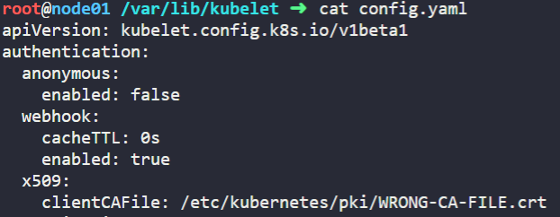
역시나 CA 파일의 경로가 잘못되어 있다. 해당 경로를
/etc/kubernetes/pki/ca.crt로 바꾸어준다.
그 후 kubelet을 restart 해준다.
```
$ root@node01 ~ ➜  systemctl restart kubelet
$ root@node01 ~ ➜  systemctl status kubelet
```
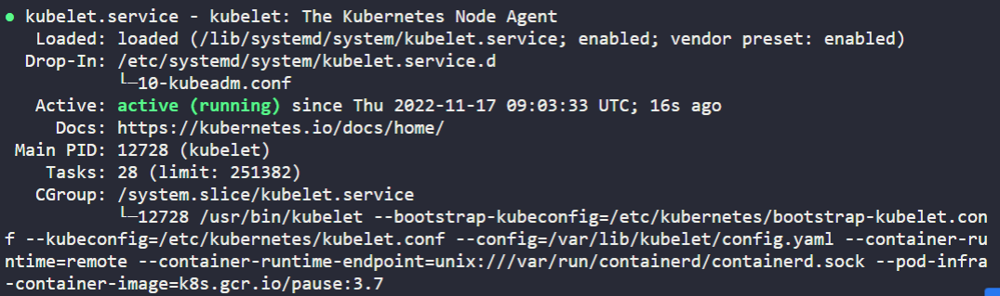
정상으로 돌아왔다.
<br></br>
(3)
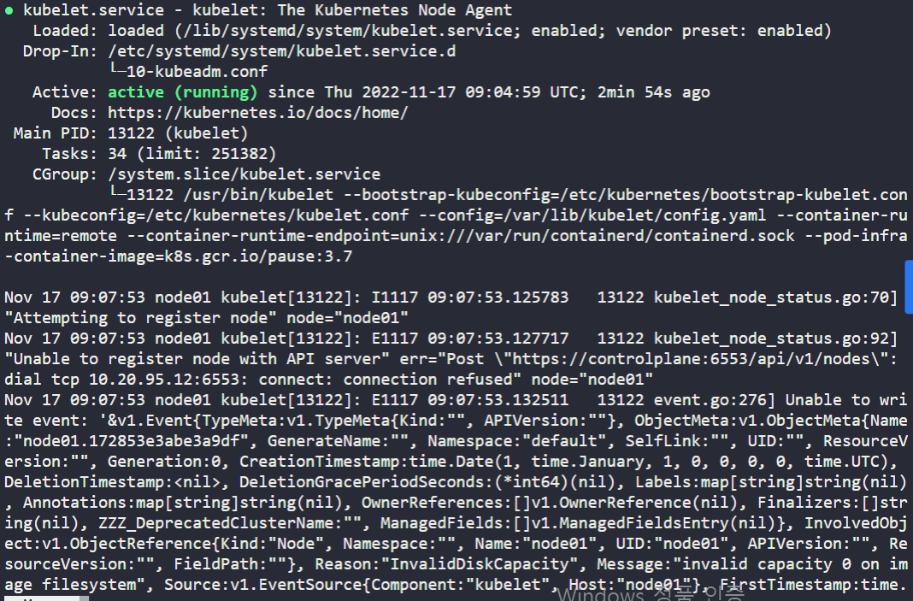
kubelet이 활성화가 되어있지만 에러코드가 보인다. 
API Server와 관련된 항목에서 포트가 default값인 6443이 아닌 6553임을 확인할 수 있다. /etc/kubernetes/의 kubelet.conf 파일을 확인해 본다.
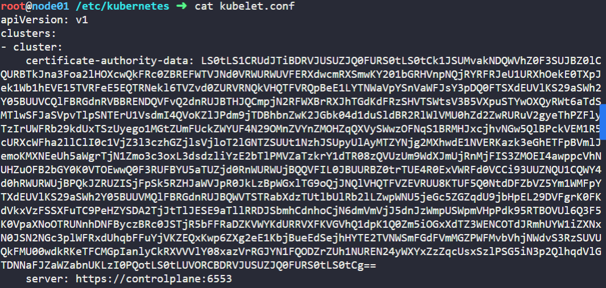
역시나 6553으로 되어있다. 6443으로 수정하고 재시작 한다.
```
$ root@node01 ~ ➜  systemctl restart kubelet
$ root@node01 ~ ➜  systemctl status kubelet
```
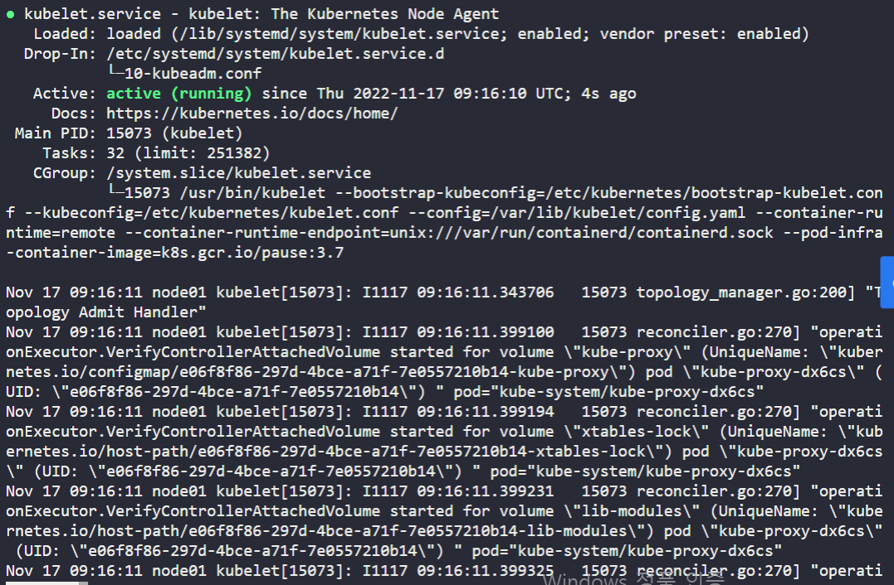
문제없이 잘 동작하는 것을 확인할 수 있다.