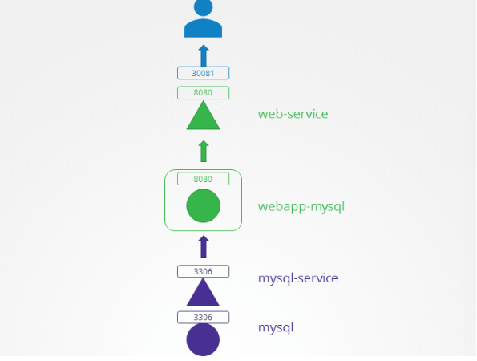

# kubernetes troubleshooting
## 1. Application Failure
- check Service: Service의 Selector에 있는 labels이 현재 동작되는 Application(pod)의 labels와 같은지 확인
- 다음과 같은 아키텍처 구조에서 직접 troubleshooting 해보기

1. mysql-service
```
$ kubectl describe svc mysql-service -n=beta
Name:              mysql-service
Namespace:         beta
Labels:            <none>
Annotations:       <none>
Selector:          name=mysql
Type:              ClusterIP
IP Family Policy:  SingleStack
IP Families:       IPv4
IP:                10.43.111.162
IPs:               10.43.111.162
Port:              <unset>  3306/TCP
TargetPort:        8080/TCP
Endpoints:         10.42.0.11:8080
Session Affinity:  None
Events:            <none>
```
TargetPort가 해당 아키텍쳐와 달리 8080으로 설정되어 있으므로, 3306으로 바꾸어준다.
```
apiVersion: v1
kind: Service
metadata:
  name: mysql-service
  namespace: beta
spec:
    ports:
    - port: 3306
      targetPort: 3306
    selector:
      name: mysql
```
2. Service의 Selector와 expose해야되는 pod의 Labels가 일치하는지 확인
```
$ kubectl describe svc mysql-service -n=gamma
Name:              mysql-service
Namespace:         gamma
Labels:            <none>
Annotations:       <none>
Selector:          name=sql00001

$ kubectl describe po mysql -n=gamma
Name:         mysql
Namespace:    gamma
Priority:     0
Node:         controlplane/172.25.0.16
Start Time:   Sat, 12 Nov 2022 14:22:52 +0000
Labels:       name=mysql
```
mysql-service의 Selector를 'edit svc'를 통해 name=mysql로 바꾸어준다.
3. Service의 NodePort 확인
```
kubectl -n zeta get svc web-service
NAME          TYPE       CLUSTER-IP    EXTERNAL-IP   PORT(S)          AGE
web-service   NodePort   10.43.8.200   <none>        8080:30088/TCP   19s
```
NodePort는 30081번이 open되어 있어야 하지만,30088이 open되어 있으므로 'edit svc'를 통해 .spec.ports.nodePort 값을 수정한다.
